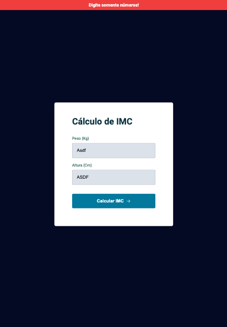
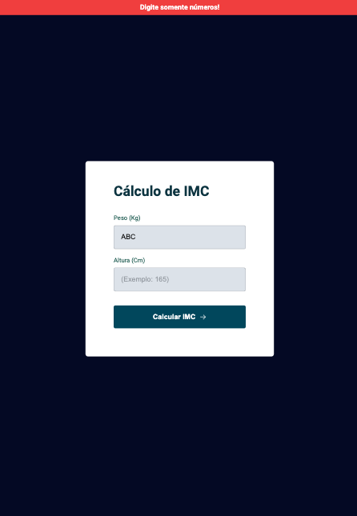
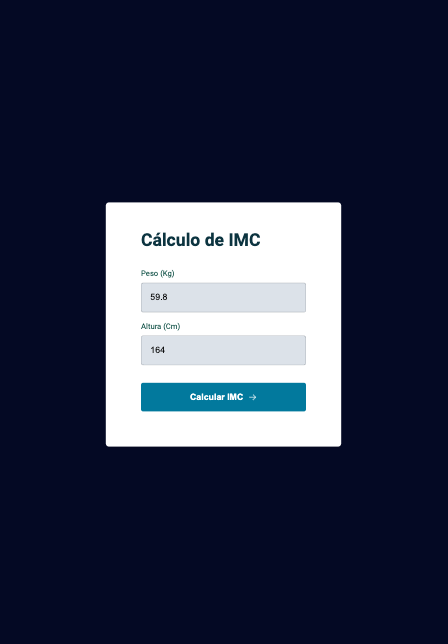
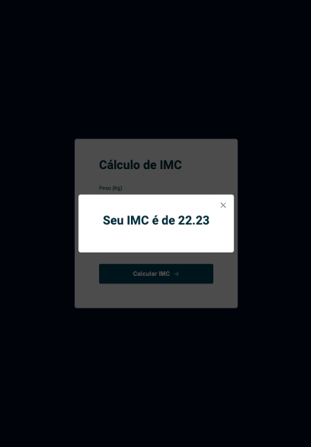

# 📊 🇧🇷 Projeto Cálculo de *IMC* (Índice de massa corporal)    🇺🇸 _Project Calculation of *BMI* (Body Mass Index)_ 

📸 Screenshot of project:

# 👩🏻‍💻 Projeto / _Project_: 

🇧🇷 Neste projeto construi uma calculadora de IMC, este desafio consiste em criar uma ponte entre a calculadora e a WEB. 
Neste desafio, o usuário final consegue adicionar o peso e a altura para obter o retorno com o cálculo de seu IMC. 

Com a linguagem JavaScript criei um Pop-up (Modal), que conseguimos fechar a tela de apresentação do resultado do cálculo de IMC, com o teclado (esc) ou com o mouse em cima do "X". 

Se acaso errar algum valor como, acrescentar texto no lugar de números ou se acaso algum campo estiver vazio, como peso e altura não forem preencheidos com números, vai abrir um erro em vermelho na parte superior da tela escrito: "Digite somente números!"

#

🇺🇸 _In this project I built a BMI calculator, this challenge is to create a bridge between the calculator and the WEB. In this challenge, the end user is able to add weight and height to obtain the return with the calculation of their BMI._

_With the JavaScript language I created a Pop-up (Modal), which we were able to close the presentation screen of the BMI calculation result, with the keyboard (esc) or with the mouse over the "X"._

_If you happen to make a mistake, such as adding text instead of numbers or if any field is empty, such as weight and height not being filled in with numbers, an error will open in red at the top of the screen with the words: "Type only numbers!"_

# 🕵🏻‍♀️ Informação complementar    _Complementary information_: 

🇧🇷 O índice de massa corporal (IMC) é uma medida internacional usada para calcular se uma pessoa está no peso ideal. Desenvolvido pelo polímata Lambert Quételet no fim do século XIX, trata-se de um método fácil e rápido para a avaliação do nível de gordura de cada pessoa, sendo, por isso, um preditor internacional de obesidade adotado pela Organização Mundial da Saúde (OMS).

🇺🇸 The body mass index (BMI) is an international measure used to calculate whether a person is at an ideal weight. Developed by the polymath Lambert Quételet at the end of the 19th century, it is an easy and quick method for assessing the level of fat in each person, and is therefore an international predictor of obesity adopted by the World Health Organization (WHO) .

# 👩🏻‍🏫 Como calcular o IMC    _How to calculate BMI_:
🇧🇷 O IMC é calculado dividindo o peso pela altura elevada ao quadrado. Ou seja, de forma mais simples, você multiplica sua altura por ela mesma e depois divide seu peso pelo resultado da última conta. 

🇺🇸 BMI is calculated by dividing weight by height squared. That is, in a simpler way, you multiply your height by itself and then divide your weight by the result of the last account. 

# ⚖️ Tabela de IMC   _BMI table_:
🇧🇷 Você pode utilizar a tabela abaixo para consultar o seu índice de massa corporal:

Resultado:  
<li>🔵 Abaixo de: 17	Muito abaixo do peso; </li>
<li>🟢 Entre: 17 e 18,49	Abaixo do peso;</li>
<li>🟡 Entre: 18,50 e 24,99	Peso normal;</li>
<li>🟠 Entre: 25 e 29,99	Acima do peso;</li>
<li>🔴 Entre: 30 e 34,99	Obesidade I;</li>
<li>🟣 Entre: 35 e 39,99	Obesidade II (severa);</li>
<li>⚫️ Acima de: 40	Obesidade III (mórbida).</li>

# 

🇺🇸 You can use the table below to check your body mass index:

_Result:_ 
<li>🔵 Under: 17 Very underweight; </li>
<li>🟢 Between: 17 and 18.49 Underweight;</li>
<li>🟡 Between: 18.50 and 24.99 Normal weight;</li>
<li>🟠 Between: 25 and 29.99 Overweight;</li>
<li>🔴 Between: 30 and 34.99 Obesity I;</li>
<li>🟣 Between: 35 and 39.99 Obesity II (severe);</li>
<li>⚫️ Above: 40 Obesity III (morbid).</li>

 

#  🚀 Tecnologias / Technologies:

- [HTML](../index.html)
- [CSS](../style.css)
- [JavaScript](../js/script.js)
- [Github](##github.com)
- [Codepen](##codepen)
- [VScode](##vscode)

📸 Screenshot-error

📸 Screenshot calculator in use

📸 Screenshot pop-up (modal) 
 

# 
### 🔗 Link do projeto on-line aqui:   🔗 Online project link here:
 
- **🇧🇷 [Projeto online](http://127.0.0.1:5500/index.html)**
- **🇺🇸 [Online project](http://127.0.0.1:5500/index.html)**

#

🗓️ 🇧🇷 Data da conclusão do projeto: Agosto de 2023.
 
🗓️ 🇺🇸 Project completion date: August 2023.

# 

                Feito com 🤍 by BM